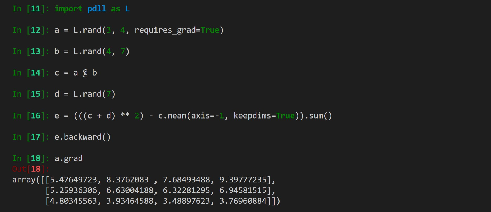

# PDLL
> Python Deep Learning Library, including autograd, nn modules, optimizer, .etc.

--- 
## DOCS
    - [ ] TODO
    

## CODE

## TODO

- [x] backend
    - [x] numpy
- [x] autograd
    - [x] function
        - [x] forward
        - [x] backward
    - [x] engine
        - [x] backward propagation
    - [x] variable
        - [x] +, -, *, /, **, @, slice
        - [x] broadcasting
        - [x] reshape, transpose
        - [x] sum, mean, var
        - [x] creation
            - [x] rand, randn
            - [x] ones, zeros, *_like
            - [x] from_numpy
- [x] nn
    - [x] parameter
    - [ ] modules
        - [x] dense
        - [x] bn2d
        - [x] conv2d
            - [x] group
            - [x] dilation
        - [x] pooling2d
            - [x] avg
            - [x] max
        - [x] activation
            - [x] relu
            - [x] tanh
            - [x] sigmoid
        - [x] softmax
        - [ ] dropout
    - [ ] loss
        - [x] mse
        - [x] cross entropy
- [ ] optim
    - [ ] optimizer
        - [x] sgd
        - [ ] adam
    - [ ] lr_scheduler
- [ ] data
    - [ ] dataset
    - [ ] dataloader
- [ ] serializable
    - [ ] save
    - [ ] load

